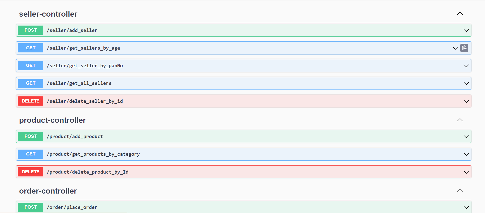

# E-Commerce Backend Application

An E-commerce backend application using Spring Boot is designed to manage and store product information, user data, seller data and order processing, while providing secure and efficient API endpoints for client interactions.

## Prerequisites

- JDK 11 or Higher
- Maven
- MySQL Database
- IntelliJ Idea 
##  Usage

The E-commerce backend application built with Spring Boot enables users to browse, add products to their cart, and seamlessly proceed to order products either directly or from their saved cart, also provide functionality to order every product from the saved cart, facilitating a convenient and efficient shopping experience.

### Add to cart
- MySQL create a new table for cart in the database.
- It takes CustomerID , ProductID , and Required Quantity for the product and then save it to the cart.
- Cart table consist of cartId , customerID and total price of cart.
- Return a message after adding product to cart

### Direct Place order
- MySQL create a new table for cart in the database.
- It takes CustomerID , ProductID , and Required Quantity for the product and then place Order.
- Return Order details after placing an order of a product.

### Checkout Cart
- In this API user able to order everything from the cart by just one click.
- It order every product individually and produce order details for every product.
- After order everything it empty the cart and set cart total = 0.

### Features Implemented
- Implemented DTO's (Data Transfer Object).
- Implemented MVC Architechture.
- Implemented Exception Handling.
- Implemented 15+ API's.
- Used Swagger to showcase the List of API's.
- Used Java Mail Sender to recieve email for every order.

## Contributing

Contributions to the E-Commerce Backend Application are welcome. If you find any issues or have suggestions for improvement, please create a new issue or submit a pull request.

## Screenshot

